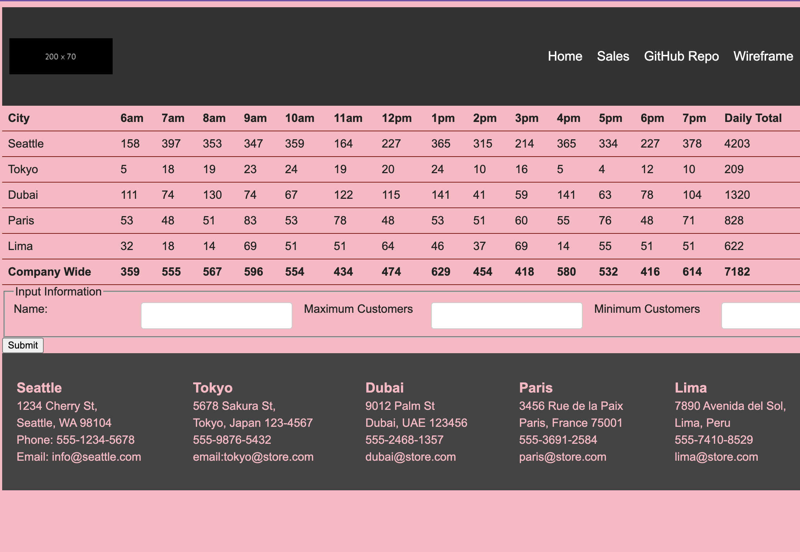

# Class 8

The flex model
## Reading Objectives

Useful to remember

> From mozilla documentation

#### Columns or Rows

Flex-direction default set to row, but can be changed to column flex-direction: column

#### Wrapping

Sometimes our flexbox can overflow their container and break the layout--like this issue in our cookiestand website when we implemented the input boxes.

When this happens we can use flex-wrap to our section rule, and also change our article to 200px

We can also adjust the text from the left side of the flexbox to the right side of the flexbox with the flow-direction: row-reverse

[Flexbox Cheatsheet](https://css-tricks.com/snippets/css/a-guide-to-flexbox/)

Prompt Questions/answers

Reading
Learn CSS - Flexbox

### 1. Flexbox is designed for one-dimensional content. Explain what this means.

Flexbox is designed for one-dimensional content, or content that lies on a single axis, either horizontally or vertically.

### 2. Explain the difference between the main axis and cross axis.

The main axis is the primary axis which the flex items are arranged. While the cross axis is the secondary axis that is perpendicular to the main axis.

### 3. How can using certain properties of flexbox negatively impact accessibility?

The reordering of flex items only happens for the visual order, not the logical order. THis means that it could make it inaccessible for screen readers.

CSS Layout - Flexbox

Read up to “Flex-Flow Shorthand”

### 4. What are some advantages of using flexbox over float?

They make it easier to create responsive layouts, are more intuitive and easier to learn, and provide better allignemnt and spacing control.

### 5. How does this topic connect with your long term goals?

I think Flexbox will make front end a lot more accessible for me as it's the responsiveness that always seems overwhelming to me.

